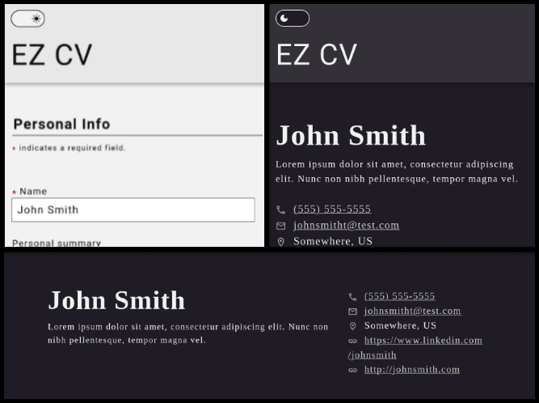

# EZ CV

  

## Description

An accessible CV building app, created with React. Checkout [EZ-CV](https://thatblindgeye.github.io/ez-cv/) to see how 'ez' it can be!

### Features

#### Themes

Choose between a dark or light theme when building your CV.

#### Responsive

Edit and preview on small devices to large, and zooming functionality will work whether your browser is set to zoom the entire page or only text.

#### Personal Information

In addition to the required name, phone number, and email fields, you can also add your LinkedIn page as well as another personal website. Want to share your GitHub profile or a portfolio site? Now you can!

#### Work and Education History

Add multiple items for your work or education history. Your work history can include any responsibilities you had in the role, and both work and education can include a date range (with the ability to mark an item as currently employed or enrolled).

**Note:** The responsibilities field in the Work Experience section will not retain any line breaks in preview mode.

#### Download

Once you finish filling out and previewing your CV, you'll be able to download it as a PDF.

#### Preview

Once you've entered all your information and have ensured any and all fields are valid, you'll be able to preview your CV! You can swap between the edit mode and preview mode as you need, just in case you notice you've made a mistake anywhere.

### How-To

#### Phone and Email

When adding a phone number, the only valid characters (in addition to numbers!) are the plus (+) symbol at the very beginning of the number, open or close paranthesis after the plus (+) symbol, spaces, and hyphens. Only one set of paranthesis can be included.

When adding an email address, you must follow the standard email format: a username ("johnsmith"), followed by the 'at' (@) symbol, and ending with the domain ("gmail.com").

#### URLs

When adding a URL to the LinkedIn or Website fields, make sure the link you provide begins with either the `https://` or `http://` protocol, otherwise the URL will not be validated and you will not be able to preview your CV.

## Issues During Creation/Misc. Notes

Learning how to use React has been one of the most interesting concepts yet, but also one of the more difficult.

Dealing with React felt at times like a huge puzzle, trying to understand where to put each individual piece in a way that the bigger picture made sense. I thoroughly enjoyed this aspect of React, but it was also tough at times to 'think in React'. As I progressed through the project, I began seeing spots that I could have planned out better from the beginning, or thought of better ways to create or use a component.
